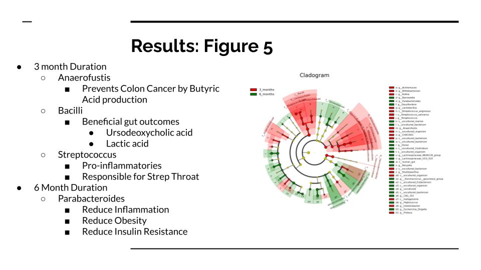

## Portfolio

---

### Projects (Technical Skills Overview) 

[Exercise Influence on Gut Diversity for Colon Cancer Patients](https://docs.google.com/presentation/d/17PMgU1ipm1UCJ_GMMOfk_NQJ0F9qKpWfzYt9vQ6b2Dw/edit?slide=id.p#slide=id.p)

Description: > 
  Unix based environment to process NGS data to create and run scripts with conda. Multiple visualizations created to show exercise benefits    on colorectal cancer patients' gut microbial comunity. 
---
[Project 2 Title](/pdf/sample_presentation.pdf)

---
[Project 3 Title](http://example.com/)

---

Page template designed by <a href="https://github.com/evanca/quick-portfolio">evanca</a>

<!-- Remove above link if you don't want to attibute -->
